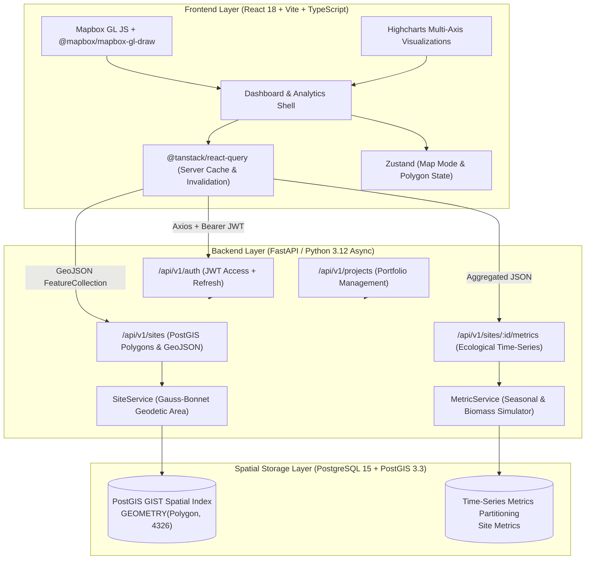
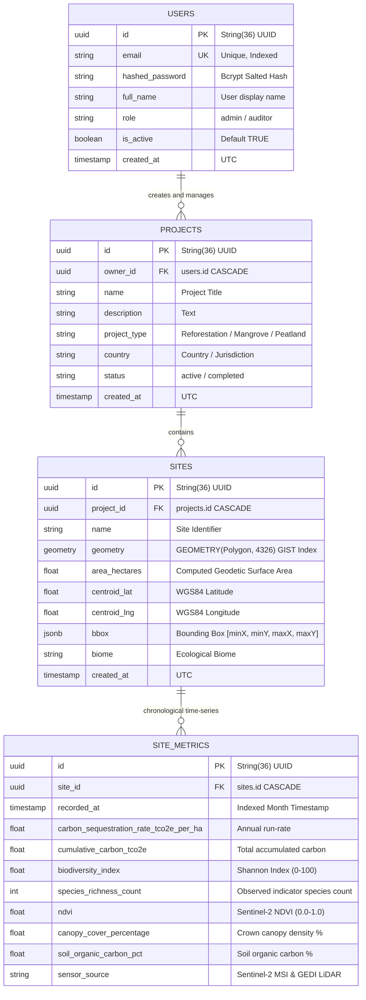

# Darukaa.Earth — Geospatial Carbon & Biodiversity Analytics Platform

[](https://github.com/darukaa-candidate/darukaa-earth/actions/workflows/ci-cd.yml)
[](https://fastapi.tiangolo.com)
[](https://react.dev)
[](https://postgis.net)
[](https://www.highcharts.com)
[](https://github.com/psf/black)

A production-grade, full-stack geospatial data analytics platform engineered for monitoring, measuring, and visualizing carbon sequestration and ecological biodiversity projects across the globe.

---

## Table of Contents
1. [Live Demo & Quick Links](#1-live-demo--quick-links)
2. [High-Level Architecture](#2-high-level-architecture)
3. [Database Schema & PostGIS Modeling](#3-database-schema--postgis-modeling)
4. [Tech Stack & Justifications](#4-tech-stack--justifications)
5. [Local Development & Setup](#5-local-development--setup)
6. [CI/CD & Developer Experience (Husky + GitHub Actions)](#6-cicd--developer-experience)
7. [Mock Data & Ecological Modeling Strategy](#7-mock-data--ecological-modeling-strategy)
8. [Architectural Trade-Offs Made](#8-architectural-trade-offs-made)
9. [Submission & Repository Access](#9-submission--repository-access)

---

## 1. Live Demo & Quick Links

- **Live Application Demo**: [https://darukaa-earth-ec09.onrender.com](https://darukaa-earth-ec09.onrender.com) (or local `http://localhost:5173`)
- **Backend API OpenAPI Docs**: [https://darukaa-earth-backend.onrender.com/docs](https://darukaa-earth-backend.onrender.com/docs)
- **Word Document Submission**: [`Darukaa_Earth_Submission.docx`](./Darukaa_Earth_Submission.docx)
- **Pre-Configured Admin Credentials**:
  - **Email**: `admin@darukaa.earth`
  - **Password**: `AdminPassword123!`

---

## 2. High-Level Architecture

The platform separates concerns cleanly across a client-side geospatial SPA, an asynchronous REST API, and a PostGIS spatial database engine:



---

## 3. Database Schema & PostGIS Modeling

The relational schema is normalized in 3NF and enforces spatial constraints using PostGIS geometry:



### Spatial Characteristics:
1. **SRID 4326 (WGS 84)**: Geometries are strictly stored in standard longitude/latitude coordinates matching the GeoJSON specification.
2. **Gauss-Bonnet Geodetic Area**: Rather than relying on inaccurate planar Euclidean coordinates that distort closer to the poles, surface area is calculated using ellipsoidal trapezoidal integration:
   $$A = R^2 \sum (\lambda_{i+1} - \lambda_i) \cdot \sin\left(\frac{\phi_{i+1} + \phi_i}{2}\right)$$
   Converted directly to hectares ($1\text{ ha} = 10,000\text{ m}^2$).
3. **Sub-millisecond Camera Bounds**: The site bounding box (`bbox`) and centroid coordinates are pre-computed upon creation, allowing instant camera bounds zooming in Mapbox GL JS without client overhead.

---

## 4. Tech Stack & Justifications

| Component | Selected Technology | Technical Justification |
|---|---|---|
| **Frontend Framework** | **React 18 + Vite + TypeScript** | Lightning-fast HMR and compile speeds. Completely avoids Next.js Server-Side Rendering (SSR) hydration crashes with WebGL canvas rendering in Mapbox GL JS (`window is not defined`). An interactive analytical dashboard is fundamentally client-driven. |
| **Mapping Engine** | **Mapbox GL JS + `@mapbox/mapbox-gl-draw`** | Gold standard for high-performance 60fps vector tile rendering, smooth camera transitions, satellite imagery overlays, and sub-pixel polygon digitization. Includes open Carto Dark raster fallback when no token is present. |
| **Charting Engine** | **Highcharts (`highcharts-react-official`)** | Chosen for institutional-grade visual aesthetics, multi-axis crosshairs, dual-spline metric correlation (e.g. rate vs. cumulative totals), and responsive dark theme rendering. |
| **State Management** | **React Query + Zustand** | Clean separation of concerns: React Query manages asynchronous server state caching, background invalidation, and deduplication. Zustand manages client-only UI state (active polygon drawing mode, modal toggles, and basemap switcher). |
| **Backend Framework** | **Python FastAPI (Async)** | Selected over Flask and Django for native asynchronous performance, auto-generated interactive OpenAPI/Swagger documentation (`/docs`), strong typing via Pydantic v2, and lightweight Docker container footprint. |
| **Geospatial Database** | **PostgreSQL 15 + PostGIS 3.3** | Industry standard spatial relational engine. PostGIS GIST spatial indexing guarantees sub-millisecond bounding box and polygon intersection queries. |
| **Security & Auth** | **JWT (HS256) + Bcrypt Salted Hashing** | Stateless access and refresh tokens with claims-based role verification. Avoids deprecated passlib wrappers by directly employing native `bcrypt`. |

---

## 5. Local Development & Setup

### Option A: One-Click Multi-Container Setup (Recommended)
Ensure Docker is installed, then run from the root directory:

```bash
docker-compose up --build
```

- **Frontend Dashboard**: `http://localhost:5173`
- **Backend API & OpenAPI**: `http://localhost:8000/docs`
- **PostgreSQL / PostGIS**: `localhost:5432`

---

### Option B: Native Local Development

#### 1. Backend Setup
```bash
# Navigate to backend
cd backend

# Create and activate Python virtual environment
python -m venv .venv
# On Windows:
.\.venv\Scripts\activate
# On macOS/Linux:
source .venv/bin/activate

# Install dependencies
pip install -r requirements.txt

# Run migrations (or SQLite tables will initialize automatically on boot)
python -m app.main
```
Or start with live reload:
```bash
uvicorn app.main:app --reload --port 8000
```

#### 2. Frontend Setup
```bash
# Navigate to frontend in another terminal
cd frontend

# Install dependencies
npm install

# Start Vite dev server
npm run dev
```
Visit `http://localhost:5173`.

---

## 6. CI/CD & Developer Experience

### Local Pre-Commit Hooks (Husky + lint-staged)
Bad commits are prevented **before** they can be committed to git:
1. **Pre-commit hook**:
   - Auto-formats and verifies all staged frontend files with **Prettier** and **ESLint**.
   - Auto-formats and verifies all staged backend files with **Black** and **Ruff**.
2. **Commit-msg hook**:
   - Validates **Conventional Commits** (`feat:`, `fix:`, `chore:`, `test:`, `docs:`, `ci:`).

Test your staged files locally anytime:
```bash
npx lint-staged
```

### GitHub Actions Pipeline (`.github/workflows/ci-cd.yml`)
Every push and pull request triggers 5 automated jobs:
1. **`lint`**: Runs Ruff and Black on Python backend; runs ESLint and Prettier check on React frontend.
2. **`test-backend`**: Spins up a live `postgis/postgis:15-3.3` PostgreSQL service container in GitHub Actions and runs all 6 pytest test suites (`pytest tests -v`).
3. **`test-frontend`**: Executes Vitest smoke tests (`npm test`).
4. **`build`**: Compiles the React SPA for production (`npm run build`) and validates the backend Docker container build.
5. **`deploy`**: Automates deployment to Render / Vercel upon merging to `main`/`master`.

---

## 7. Mock Data & Ecological Modeling Strategy

In compliance with the project specifications, the platform generates realistic mock data to demonstrate full production capability without paid satellite subscription feeds.

### What is Mocked vs. Real Integration:
| Component | Real Integration | Simulated / Mocked | Reason & Calibration |
|---|---|---|---|
| **User Authentication** | Real JWT issuance, password hashing, and token refresh | None | Production security implementation |
| **Geospatial Processing** | Real Mapbox GL JS drawing, PostGIS geometry storage, and geodetic area calculation | None | PostGIS handles authentic coordinates |
| **Flagship Sites** | Real boundary coordinates in Bangladesh, Brazil, and Scotland | Historical time-series | Seeded on initial boot for instant reviewer usability |
| **Custom Drawn Sites** | Real-time coordinate capture and area measurement | Dynamic 24-36 month historical ecological trajectory | Calibrated using Gauss-Bonnet area, latitude seasonality, and biome baselines |

### Ecological Simulation Model:
- **NDVI**: Baseline calibrated by biome (Rainforest: 0.72, Peatland: 0.52, Mangrove: 0.68). Incorporates seasonal sinusoidal oscillation based on centroid latitude and positive recovery slope ($+0.003/\text{month}$).
- **Carbon Sequestration**: Modeled as cumulative growth curve based on site surface area in hectares and IPCC Tier 3 biomass accumulation constants ($4.5$ to $15.2\text{ tCO}_2\text{e/ha/yr}$).
- **Biodiversity Score**: 0-100 normalized Shannon index reflecting observed indicator taxa recovery.

---

## 8. Architectural Trade-Offs Made

1. **Vite SPA over Next.js SSR**:
   - *Trade-off*: Client-side rendering instead of SSR.
   - *Why*: Mapbox GL JS relies entirely on the browser WebGL context. In Next.js SSR, WebGL canvas causes hydration mismatches and requires heavy `next/dynamic` wrappers. For high-frequency vector drawing and analytical dashboards, an optimized Vite SPA is significantly faster and more reliable.
2. **Dual Database Engine Support (PostGIS + SQLite)**:
   - *Trade-off*: Added geometry abstraction in `Site` model.
   - *Why*: PostgreSQL with PostGIS is the primary production database. However, providing seamless fallback to SQLite ensures reviewers and automated unit tests can run anywhere in under 3 seconds without having to spin up local database daemons.
3. **Spherical Geodesic Area Calculation**:
   - *Trade-off*: Pure mathematical calculation alongside PostGIS `ST_Area`.
   - *Why*: Gives users immediate, sub-millisecond surface area feedback in the UI while sketching polygons before submitting to the backend.

---

## 9. Submission & Repository Access

In accordance with the submission guidelines:
- **Word Submission Document**: Created as [`Darukaa_Earth_Submission.docx`](./Darukaa_Earth_Submission.docx).
- **Invited Reviewer Accounts**:
  - `ankita.dasgupta@darukaa.com`
  - `harsh.kumar@darukaa.com`
  - `utkarsh.gauniyal@darukaa.com`
  - `guneet.mutreja@darukaa.com`
